<h3><code>pavan@github ~ $ ./contributions.sh</code></h3>

  

<h3><code>pavan@github ~ $ whoami</code></h3>

 

<h3><code>pavan@github ~ $ cat info.txt</code></h3>

 

<h3><code>pavan@github ~ $ cat projects.txt</code></h3>

| Project | Stack | Status |
|---|---|---|
| 🚀 [CareerOS AI](https://careeros-ai-amcb.onrender.com) | React · Node.js · LLaMA | Live |
| 🌐 Web Dev Projects | HTML · CSS · JS · React | Completed |

 

<h3><code>pavan@github ~ $ echo $STATUS</code></h3>

**Open to internships · Full Stack · AI/ML · Web Dev · Hyderabad / Remote**

